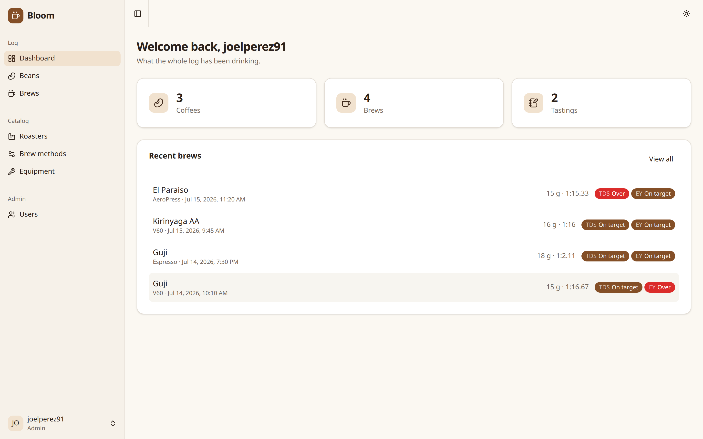
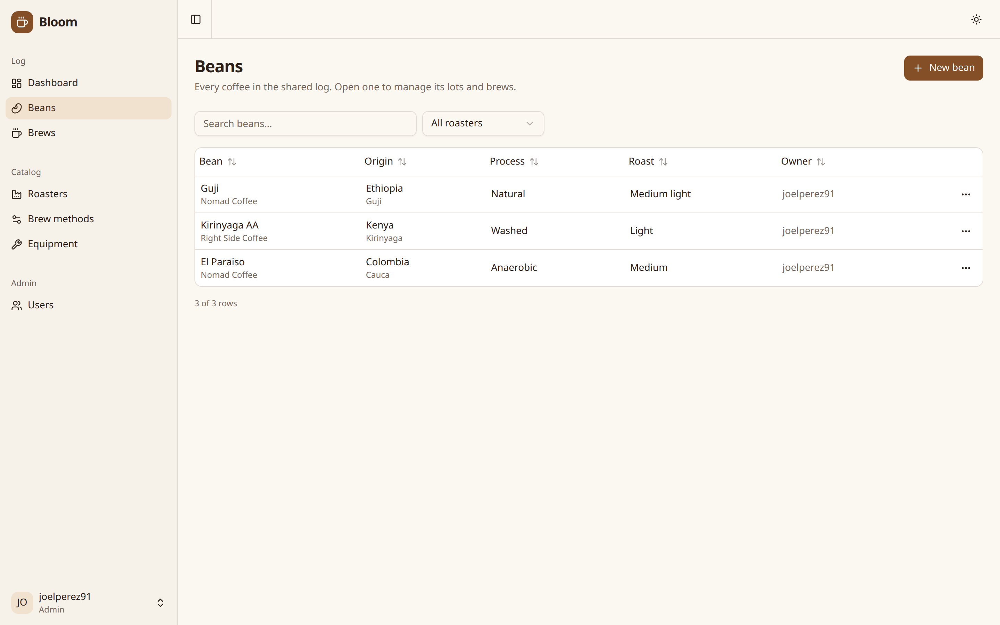
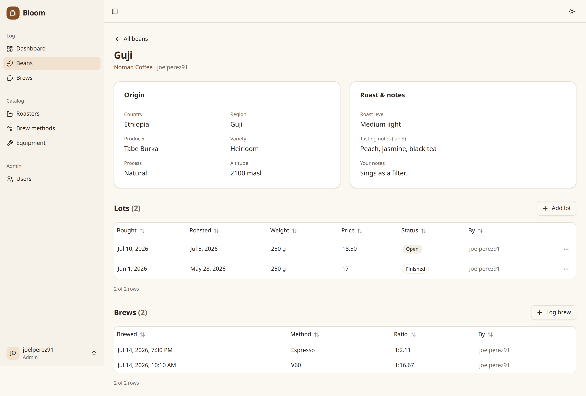
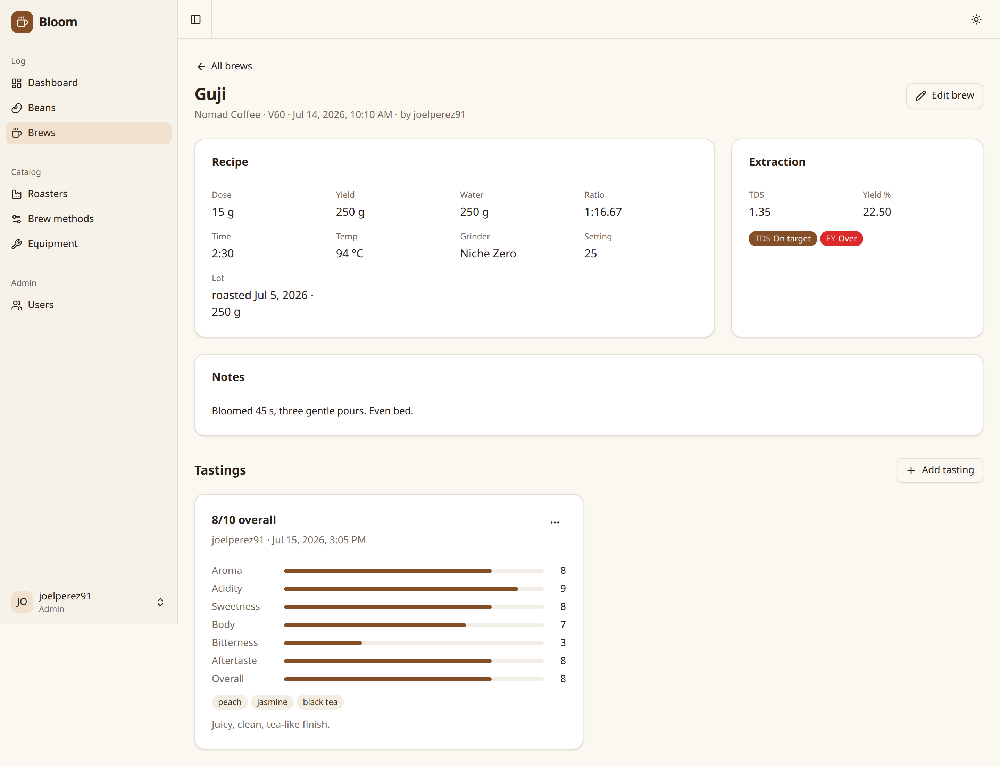

# Bloom ☕

Self-hosted tracking for the specialty coffee you brew — at home or behind the bar.
Bloom records the beans you buy, every brew you pull or pour, and how each one tasted,
so you can find what actually makes a good cup repeatable.

## Screenshots

The shared dashboard — coffees, brews and recent extractions at a glance:



| Beans, filterable by roaster | A coffee: its lots and its brews |
| :--: | :--: |
|  |  |

A brew with its recipe, extraction-yield diagnostics and a tasting:



## Quick start

Bloom ships as a **single container** (API + web UI) that runs alongside Postgres via Docker
Compose — the only requirement is Docker:

```bash
# 1. Configure — set BLOOM_ADMIN_EMAIL / BLOOM_ADMIN_PASSWORD and a strong JWT_SECRET
cp .env.example .env

# 2. Start Postgres + Bloom
docker compose -f docker/docker-compose.yml up -d
```

Open **http://localhost:8000** — the web UI, with the API under `/api/v1` and interactive
Swagger docs at **`/docs`**.

On startup Bloom waits for the database, applies any pending migrations, and bootstraps the
first admin — there is no separate migration step. It runs as a **single instance**, which
keeps migrating in-process simple and safe.

> Compose pulls the published `jpizquierdo/bloom` image. To build it yourself, run the app from
> source, or hack on it, see [Development](#development).

## Configuration

Settings come from environment variables or a local `.env` (copy `.env.example`):

| Variable | Purpose |
|----------|---------|
| `POSTGRES_USER` / `POSTGRES_PASSWORD` | Postgres credentials (default `bloom` / `bloom`). |
| `POSTGRES_SERVER` / `POSTGRES_PORT` / `POSTGRES_DB` | Postgres host, port and database (default `localhost` / `5432` / `bloom`). |
| `JWT_SECRET` | Access-token signing key — **set a strong value in production**. |
| `ACCESS_TOKEN_EXPIRE_MINUTES` | Access-token lifetime (default 60). |
| `LOG_LEVEL` | Logging level for the `bloom` logger (default `INFO`). |
| `FRONTEND_HOST` | Origin of the Vite dev server, allowed by CORS (default `http://localhost:5173`). Not needed in production: the image serves the UI from the API's own origin. |
| `BACKEND_CORS_ORIGINS` | Comma-separated list of extra browser origins allowed by CORS. |
| `BLOOM_ADMIN_EMAIL` / `BLOOM_ADMIN_PASSWORD` | First admin, bootstrapped on startup if absent. |

## Authentication

There is no public sign-up. The first admin is bootstrapped from the env vars above; admins
create further users (default role `user`) via `POST /users`.

```bash
# Get a token (OAuth2 password flow; the username field takes an email or a handle)
curl -s -X POST http://localhost:8000/api/v1/auth/token \
  -d 'username=admin@example.com&password=your-password'

# Use it
curl http://localhost:8000/api/v1/auth/me -H "Authorization: Bearer <token>"
```

## API overview

Everything is served under `/api/v1` (`/health` stays at the root, for container healthchecks).
**Interactive Swagger docs live at [`/docs`](http://localhost:8000/docs)** — the fastest way to
explore the API.

| Area | Endpoints |
|------|-----------|
| Auth | `POST /auth/token`, `GET /auth/me` |
| Users (admin) | `POST /users`, `GET /users`, `PATCH /users/{id}` |
| Beans | `POST/GET /beans` (`?mine=true`), `GET/PATCH/DELETE /beans/{id}` |
| Lots | `POST/GET /beans/{id}/lots`, `GET/PATCH/DELETE /lots/{id}` |
| Roasters | `POST/GET /roasters`, `GET /roasters/{id}`; `PATCH/DELETE /roasters/{id}` and `POST /roasters/{id}/merge` are admin-only |
| Brews | `POST/GET /brews` (`?mine=true`), `GET/PATCH/DELETE /brews/{id}` |
| Tastings | `POST/GET /brews/{id}/tastings`, `GET /tastings` (`?mine=true`), `GET/PATCH/DELETE /tastings/{id}` |
| Lookups | `GET /brew-methods`, `GET /equipment` (create is admin-only) |

Bloom is a **shared log**: any authenticated user reads everything and can add beans, brew from
any bean and taste any brew; only a row's creator (or an admin) may edit or delete it. A **bean
is the coffee**, and each bag you buy is a **lot** under it — a brew names its bean and,
optionally, the lot it came from. See [`docs/ARCHITECTURE.md`](docs/ARCHITECTURE.md) for the
data model.

## Development

Run the API and the web UI from source (Postgres still comes from Compose). Needs Python 3.12+
with [`uv`](https://docs.astral.sh/uv/) and Node (via `nvm`):

```bash
# Postgres only
docker compose -f docker/docker-compose.yml up -d db

# API — http://localhost:8000, docs at /docs
uv sync
uv run fastapi dev bloom/main.py

# Web UI — http://localhost:5173, proxies /api to the API
cd frontend && npm install && npm run dev
```

The dev server runs on its own origin, so the API allows it through CORS via `FRONTEND_HOST`;
point the proxy at another API with `BLOOM_API_URL`. `fastapi dev` auto-reloads;
`fastapi run` is the production entrypoint.

- **Tests**: `uv run pytest`. Domain unit tests run without a database; API tests build a
  disposable `bloom_test` database on the running Postgres.
- **Generated client**: the UI's API client is generated from the schema. After changing a
  route or a schema, regenerate both (CI fails on drift):

  ```bash
  uv run python scripts/dump_openapi.py            # writes openapi.json at the repo root
  cd frontend && npm run generate-client           # regenerates src/client from it
  ```

- **Build the image**: `docker build -t bloom:local .`. One image compiles the SPA in a Node
  stage and FastAPI serves it from its own origin, so the UI uses **relative** URLs and the same
  image works at `localhost`, on a LAN IP, or behind a reverse proxy — no rebuild, no CORS setup.
  Point it at any Postgres with `POSTGRES_SERVER`.

## Architecture

See [`docs/ARCHITECTURE.md`](docs/ARCHITECTURE.md) for the data model, the
`routes → services → repositories → db` layering rule, and the design decisions;
[`frontend/README.md`](frontend/README.md) for the web stack and how to add a page.

## Status

Backend API and data layer are implemented (users/auth, beans, lots, brews, tastings, lookups),
and the web UI covers all of them. Sign-up and password reset do not exist yet: the UI shows
those screens but leaves them inert, and admins create accounts.
